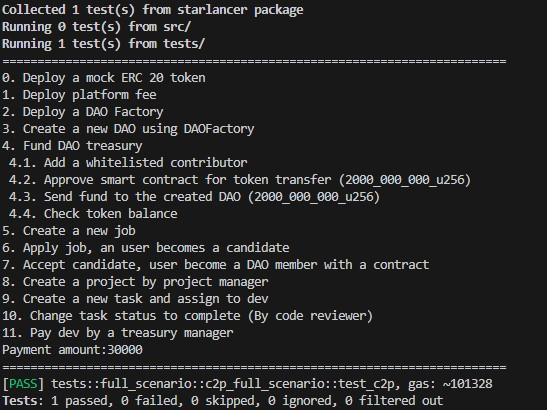
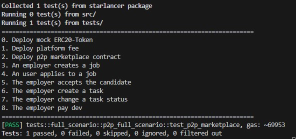
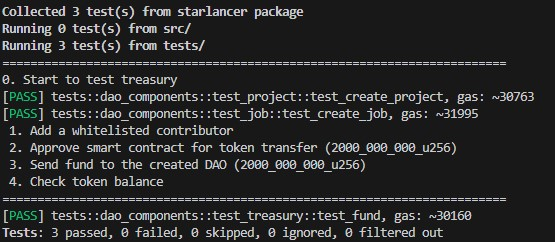
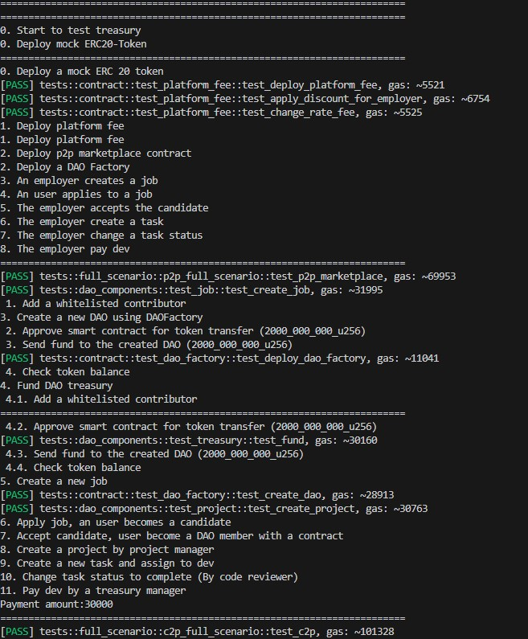

## Overview

Smart contracts for Starlancer have been developed using the [Cairo programming language](https://book.cairo-lang.org/). We have utilized the following libraries for development and testing purposes: Starknet 2.4.0, OpenZeppelin 0.8, and Snforge 0.13.

Starlancer is a decentralized job marketplace with main contracts:
- DAOFactory:
    - File: [dao_factory](starlancer/src/contracts/dao_factory.cairo).
    - Address: [0x060f85aa52eeffca2b835a0c93d553ce19689ad0edcb6faca84d332786e22721](https://testnet.starkscan.co/contract/0x060f85aa52eeffca2b835a0c93d553ce19689ad0edcb6faca84d332786e22721)
- DAO:
    - File: [dao_contract](starlancer/src/contracts/dao_contract.cairo)
    - A sample DAO address: [0x445a62793f69052a5b42218c7a989d7117b3fc09b281e5e3b7cd1fd4d25b03](https://testnet.starkscan.co/contract/0x445a62793f69052a5b42218c7a989d7117b3fc09b281e5e3b7cd1fd4d25b03)
- PlatformFee:
    - File: [platform_fee](starlancer/src/contracts/platform_fee.cairo).
    - Address: [0x01d473e9ab02f190abb0b670d621c82f0c255abdaf3db4fa8de78a3ca29d28e6](https://testnet.starkscan.co/contract/0x01d473e9ab02f190abb0b670d621c82f0c255abdaf3db4fa8de78a3ca29d28e6)
- P2P Jobs Marketplace:
    - File: [p2p_marketplace](starlancer/src/contracts/p2p_marketplace.cairo).
    - Address: [0x044d7c4130c706d0660d372191fb08b460417ecb951be9a020fd1468685f8bdc](https://testnet.starkscan.co/contract/0x044d7c4130c706d0660d372191fb08b460417ecb951be9a020fd1468685f8bdc)

We are developing a smart contract to facilitate payment through crypto streaming. This contract enables individuals to send tokens continuously, with the main purpose being salary payments. You can find more information [here](starpayment/src/stream_contract.cairo).

## Smart contract explanation

To implement a fully on-chain job marketplace with the most complex smart contracts, we separate them into smaller components.

- The DAO smart contract has four components: [job](starlancer/src/components/dao/job.cairo), [member](starlancer/src/components/dao/member.cairo), [project](starlancer/src/components/dao/project.cairo), and [treasury]((starlancer/src/components/dao/treasury.cairo)). Each component contains public functions and private functions corresponding to its purposes. If you want to customize, you can create a new component and use it in the main contract.
- The P2P jobs marketplace contract has two components: [job](starlancer/src/components/p2p/job.cairo) and [task](starlancer/src/components/p2p/task.cairo).

Each component, as its name suggests, is designed to handle a specific domain of logic. This structure helps developers extend functionality later and maintain control over the source code of complex contracts.

## Testing

We separated testing file to folders: 
- [dao_components](starlancer/tests/dao_components/): to test the separated logic domains related to job, project, treasury, and member.
- [contract](starlancer/tests/contract/): to test the basic cases of smart contracts.
- [utils](starlancer/tests/utils/): includes mock data and deployment functions..
- [full_scenario](starlancer/tests/full_scenario/): The most important test files are located here. They include:
    - [c2p_full_scenario](starlancer/tests/full_scenario/c2p_full_scenario.cairo): to simulate all steps of the entire process of hiring and payment between the DAO and developers
    - [p2p_full_scenario](starlancer/tests/full_scenario/p2p_full_scenario.cairo): To simulate all steps of the entire process of hiring and payment between employers and developers.

All testing modules are included in [lib.cairo](starlancer/tests/lib.cairo). If you don't want to run all tests, you can comment out specific lines of code.

Please note that we use snforge for testing, and the command to run the tests is: ```snforge test```.

Testing results:
- C2P Full scenario:



- P2P full scenario:



- DAO components:



- Full test:




